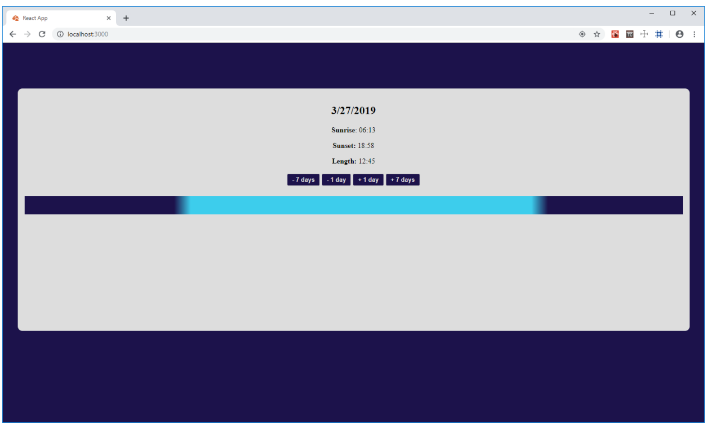

## Тестовое задание для позиции Frontend-разработчик

Сервис [sunrise-sunset.org](https://sunrise-sunset.org/api) предоставляет астрономические данные о времени рассвета
и заката, долготе дня и начале/конце сумерек для заданной широты и долготы.

Необходимо создать простую визуализацию этих данных для одной даты согласно макету ниже.

### Техническое задание:

* На странице должны отображаться текущая дата, время рассвета и заката, долгота дня
* При первой загрузке страницы должны отображаться данные для текущего
  местоположения (из API геолокации браузера) и текущего дня
* С помощью кнопок на странице можно менять дату на 1 или 7 дней вперед или назад
* Гражданские сумерки (civil_twilight) отображаются градиентным переходом
* При смене даты диаграмма должна анимироваться
* Для простоты задачи считаем, что 1 минута на диграмме равна 1 пикселю

### Требования к проекту:

* Проект должен быть создан с помощью `create-react-app`
* Версия `JavaScript ES6` и выше, либо `Typescript 3+`
* Не должны использоваться никакие дополнительные внешние пакеты

### Макет

